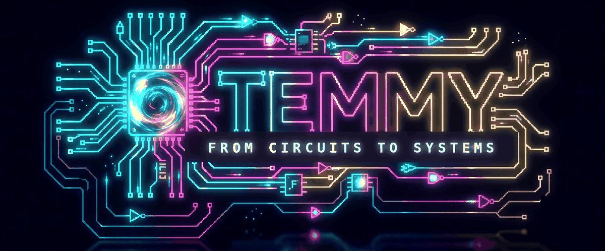
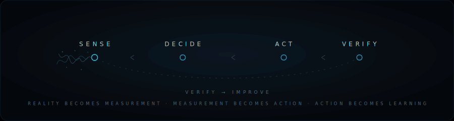

  

`ELECTRICAL & EMBEDDED ENGINEER · M.S. EE, Jackson State`

> I build hardware that **senses the physical world, decides, and acts** — then I measure whether it actually worked.

`embedded` · `sensors & signal` · `control` · `edge ML` · `validation`

---

### The operating loop

Every system I build runs the same cycle — **sense → decide → act → verify** — and loops on what it learns. It's the through-line whether the project is environmental sensing, autonomy, or control.

  

> *The best engineer isn't the one who avoids failure. It's the one who documents it.*

---

### Selected work

<b>plant-autonomy-testbed</b> &nbsp;—&nbsp; autonomous control · C++ / Python

 

A self-contained device that keeps a basil plant alive on its own — senses soil moisture, air, and light, waters a metered dose **only when the soil needs it**, and verifies each watering had an effect. Runs the grow light on a daily photoperiod and degrades safely, so it can be left unattended.

> **Log ·** built for the failure paths, not just the happy one — invalid sensor data halts watering, and WiFi/MQTT loss is non-fatal (the controller keeps running locally). A Pi-side watchdog plus an MQTT Last-Will detect when the device drops offline and grey out stale readings.

`ESP32-WROVER` · `MQTT (Mosquitto)` · `Raspberry Pi 4` · `SQLite · Streamlit` · `closed-loop control`

<b>Oyster_gape</b> &nbsp;—&nbsp; sensor calibration · C++ / Python

 

Non-contact measurement of oyster valve **gape** (how far the shells open and close) using a Micronas HAL 2425 Hall-effect sensor and a magnet. Current stage: calibrating and linearizing the sensor so its output reads directly in millimetres of gape.

> **Log ·** a clean restart where every constant is measured, not inherited. Leadscrew calibrated to **0.001 mm/pulse**; a characterization sweep feeds a 16-setpoint linearization so the output reads linearly in mm.

`ESP32` · `Hall-effect (HAL 2425)` · `sensor calibration & linearization` · `Python`

<b>pilotnet-reproduction</b> &nbsp;—&nbsp; perception · Python

 

A faithful PyTorch reproduction of NVIDIA's PilotNet — maps a single camera frame straight to a steering angle, no hand-crafted features. **MAE 0.077**, with **94.2%** of predictions within 0.20 of true steering on 9,642 held-out samples. The demo drives the track autonomously, then fails on an unusually-textured bridge — a failure mode I document rather than hide.

`PyTorch` · `CNN` · `end-to-end learning`

---

### Current system

🟢 **RUNNING** &nbsp; `plant-autonomy-testbed` — closed-loop watering, telemetry over MQTT to a Raspberry Pi (SQLite + Streamlit), monitored over Tailscale

**Currently investigating:** *How much can an embedded system actually understand about the world it's sensing?*

---

### Toolbox

| | |
|---|---|
| **Compute / MCU** | ESP32-WROVER · STM32-class · Raspberry Pi 4 · Arduino |
| **Sensing** | Hall-effect · soil moisture · temp/humidity · light · analog signal conditioning · sensor calibration & linearization |
| **Control** | closed-loop control · state machines · hysteresis & debounce · graceful degradation |
| **Comms / Telemetry** | MQTT (Mosquitto) · UART · I²C / SPI · WiFi |
| **Data / Edge** | SQLite · Streamlit · Python tooling · Tailscale |
| **ML / Perception** | PyTorch · CNNs · end-to-end learning |
| **Languages** | C / C++ · Python |

---

### Reach me

📍 Jackson, MS &nbsp;·&nbsp; open to **embedded / hardware / firmware / test** roles

[LinkedIn](https://www.linkedin.com/in/temiloluwaadesola) &nbsp;·&nbsp; [Email](mailto:temmyadesola01@gmail.com)

// from circuits to systems
