  

# Temiloluwa Adesola

`ELECTRICAL & EMBEDDED ENGINEER · M.S. EE, Jackson State`

> I build hardware that **senses the physical world, decides, and acts** — then I measure whether it actually worked.

`> from circuits to systems_`

`embedded` · `sensors & signal` · `control` · `edge ML` · `validation`

---

### The operating loop

Every system I build runs the same cycle — **sense → decide → act → verify** — and loops on what it learns. It's the through-line whether the project is environmental sensing, autonomy, or control.

  

> *The best engineer isn't the one who avoids failure. It's the one who documents it.*

---

### Selected work

<b>plant-autonomy-testbed</b> &nbsp;—&nbsp; closed-loop · Python

 

A self-contained system that keeps a plant alive on its own — reads soil and reservoir state, decides when to intervene, drives a pump, and confirms the result.

> **Log ·** first build oscillated around the moisture setpoint — pump chattering on noisy reads. Fixed with hysteresis + N-sample debounce. Watering events dropped from dozens/hour to a handful/day.

`ESP32` · `analog conditioning` · `closed-loop control` · `AWS`

<b>oyster-monitoring-system</b> &nbsp;—&nbsp; field telemetry · C++

 

Oyster shell-gape as a live water-quality biosensor, shipped off a remote site over cellular. Presented at the JSU Research Symposium 2026.

> **Log ·** two ESP32 nodes split acquisition from uplink over UART; Hall valvometry turns shell movement into voltage; LTE handles the link with no Wi-Fi. Shipped with a documented 16-issue bug audit.

`ESP32 ×2` · `UART` · `LTE` · `Hall-effect` · `AWS`

<b>pilotnet-reproduction</b> &nbsp;—&nbsp; perception · Python

 

A faithful PyTorch reproduction of NVIDIA's PilotNet — end-to-end learning that maps camera pixels straight to steering. The ML side of turning a raw signal into an action.

`PyTorch` · `CNN` · `end-to-end learning`

---

### Current system

🟢 **RUNNING** &nbsp; `plant-autonomy-testbed` — closed-loop moisture control, telemetry to AWS

**Currently investigating:** *How much can an embedded system actually understand about the world it's sensing?*

---

### Toolbox

| | |
|---|---|
| **Compute** | ESP32 · STM32-class · Raspberry Pi |
| **Sensing** | Hall-effect · capacitive moisture · LiDAR · analog conditioning |
| **Comms** | UART · I²C / SPI · LTE · MQTT / HTTP |
| **Cloud** | AWS S3 · Lambda · API Gateway |
| **Code** | C / C++ · Python |

---

### Reach me

📍 Jackson, MS &nbsp;·&nbsp; open to **embedded / hardware / firmware / test** roles

[LinkedIn](https://www.linkedin.com/in/temiloluwaadesola) &nbsp;·&nbsp; [Email](mailto:temmyadesola01@gmail.com)

// from circuits to systems
