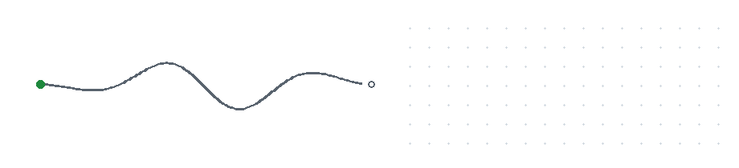
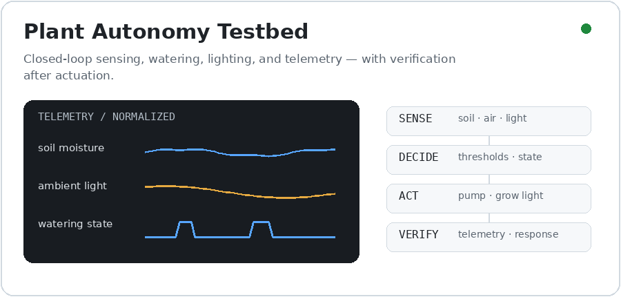
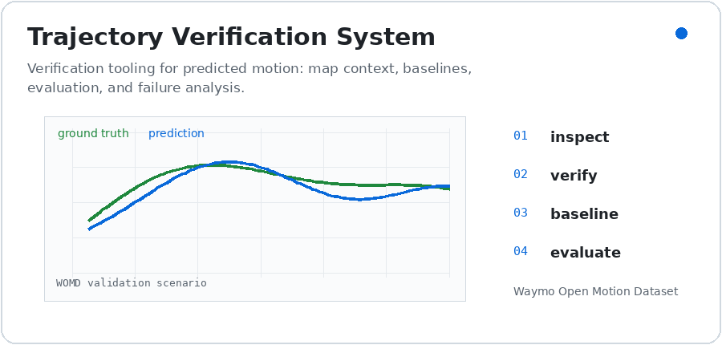
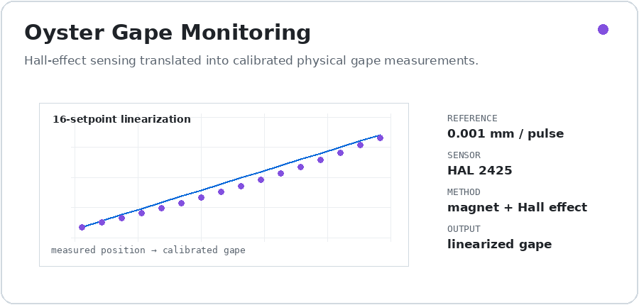

<table>
<tr>
<td width="58%" valign="middle">

<h1>Hi, I'm Temmy.</h1>

<strong>Electrical &amp; Computer Engineer</strong>

  
I build systems that <strong>sense the physical world, make decisions, and prove whether they worked.</strong>

  
hardware · embedded systems · sensing · autonomy · validation

</td>
<td width="42%" align="center" valign="middle">

</td>
</tr>
</table>

---

## Featured work

<table>
<tr>
<td width="33%" valign="top">

  
<strong>01 / <a href="https://github.com/IamTemmy/plant-autonomy-testbed">Plant Autonomy Testbed</a></strong>
 
A closed-loop embedded system that senses soil, air, and light, controls watering and lighting, and verifies what happened through telemetry.
  
ESP32-WROVER · MQTT · Raspberry Pi · SQLite · Streamlit
</td>
<td width="33%" valign="top">

  
<strong>02 / <a href="https://github.com/IamTemmy/trajectory-verification-system">Trajectory Verification System</a></strong>
 
Verification tooling for autonomous-driving trajectories using map context, baselines, evaluation, and failure analysis on the Waymo Open Motion Dataset.
  
Python · NumPy · autonomy · evaluation
</td>
<td width="33%" valign="top">

  
<strong>03 / <a href="https://github.com/IamTemmy/Oyster_gape">Oyster Gape Monitoring</a></strong>
 
Non-contact Hall-effect sensing that turns oyster valve motion into calibrated physical gape measurements.
  
ESP32 · HAL 2425 · calibration &amp; linearization · Python
</td>
</tr>
</table>

---

## From the bench

> **Plant autonomy** — Traced a grow-light outage to a hard reboot from telemetry alone: an `uptime: 6s` reading after the MQTT last-will exposed the restart. Mitigation fixed; root cause still open.

> **Oyster gape** — Rebuilt calibration from measured constants: leadscrew reference at `0.001 mm/pulse`, feeding a 16-setpoint linearization.

> **Engineering principle** — Validation is not the last phase. If a system cannot tell you whether its action worked, the loop is incomplete.

---

## More work

**[pilotnet-reproduction](https://github.com/IamTemmy/pilotnet-reproduction)** — PyTorch reproduction of NVIDIA PilotNet: one camera frame → steering angle. `MAE 0.077`; `94.2%` of held-out predictions fall within ±0.20, with failure cases documented instead of hidden.

---

Jackson, Mississippi · M.S. Electrical Engineering, Jackson State University · open to embedded / hardware / firmware / test opportunities

